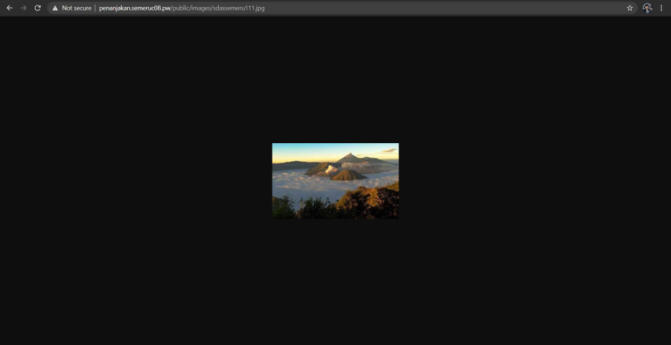
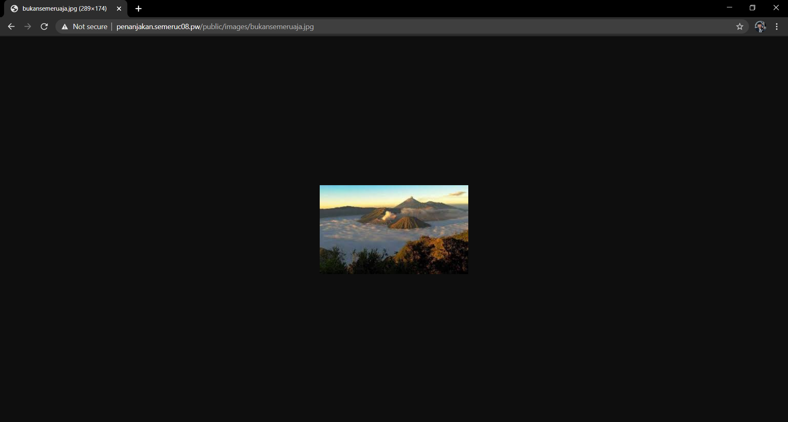

# Lapres Praktikum Jarkom Modul 2

Semeru adalah salah satu gunung yang terkenal di Jawa Timur. Bibah adalah salah satu juru kunci
Semeru. Bibah ingin menyebarkan keindahan Semeru pada dunia sehingga dia membeli 3 buah server
yang berada di MALANG, MOJOKERTO dan PROBOLINGGO. Server MALANG akan digunakan
sebagai DNS Server Master, MOJOKERTO akan digunakan sebagai DNS Server Slave dan
PROBOLINGGO akan digunakan sebagai Web Server. Selain 3 server terdapat 2 klien yang digunakan
untuk testing oleh Bibah yaitu GRESIK dan SIDOARJO. Untuk menyambungkan semua jaringan
tersebut Bibah memberi router di SURABAYA.

## Soal 1

## Soal 2

## Soal 3

## Soal 4

## Soal 5

## Soal 6

## Soal 7

## Soal 8

## Soal 9

## Soal 10

## Soal 11

## Soal 12

## Soal 13

## Soal 14

## Soal 15

## Soal 16

## Soal 17

Tambahkan kode berikut ke /var/www/penanjakan.semeruc08.pw/.htaccess

```
RewriteEngine On
RewriteRule ^public/images/?(.*)semeru(.*)\.jpg$ public/images/semeru.jpg [NC,L]
```

Hasilnya adalah sebagai berikut:



