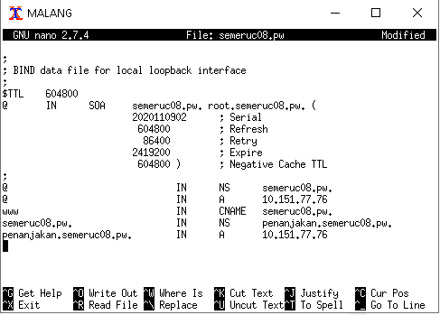

# Lapres Praktikum Jarkom Modul 2

Semeru adalah salah satu gunung yang terkenal di Jawa Timur. Bibah adalah salah satu juru kunci
Semeru. Bibah ingin menyebarkan keindahan Semeru pada dunia sehingga dia membeli 3 buah server
yang berada di MALANG, MOJOKERTO dan PROBOLINGGO. Server MALANG akan digunakan
sebagai DNS Server Master, MOJOKERTO akan digunakan sebagai DNS Server Slave dan
PROBOLINGGO akan digunakan sebagai Web Server. Selain 3 server terdapat 2 klien yang digunakan
untuk testing oleh Bibah yaitu GRESIK dan SIDOARJO. Untuk menyambungkan semua jaringan
tersebut Bibah memberi router di SURABAYA.

## Soal 1

### Soal
Buatlah sebuah website utama dengan alamat http://semeruyyy.pw

### Jawaban
- Gunakan command: **nano /etc/bind/named.conf.local** untuk mengakses file named.conf.local pada UML Malang
- Isikan konfigurasi zone sebagai berikut:
```
zone "semeruc08.pw" {
	type master;
	file "/etc/bind/jarkom/semeruc08.pw";
};
```
- Selanjutnya, gunakan command: **mkdir /etc/bind/jarkom** untuk membuat folder jarkom
- Kemudian , gunakan command: **nano /etc/bind/jarkom/semeruc08.pw** untuk membuat konfigurasi website
- Isikan konfigurasi sebagai berikut:
```
@				IN	NS	semeruc08.pw.
@				IN	A	  10.151.77.76
```
- Restart bind9 dengan command: **service bind9 restart**

Testing: 
Lakukan ping dari UML Gresik (Client) yang **nameserver** nya telah terarah menuju ke **IP Malang**


## Soal 2

### Soal
Buatlah sebuah website utama dengan alias http://www.semeruyyy.pw

### Jawaban
- Gunakan command: **nano /etc/bind/jarkom/semeruc08.pw** untuk mengubah konfigurasi website pada UML Malang
- Tambahkan konfigurasi sehingga menjadi seperti berikut:
```
@				  IN	NS      semeruc08.pw.
@				  IN	A       10.151.77.76
www				IN	CNAME   semeruc08.pw.
```
- Restart bind9 dengan command: **service bind9 restart**

Testing: 
Lakukan ping dari UML Gresik (Client) yang **nameserver** nya telah terarah menuju ke **IP Malang**


## Soal 3

### Soal
Buatlah sebuah website utama dengan subdomain http://penanjakan.semeruyyy.pw yang diatur DNS-nya pada MALANG dan mengarah ke IP Server PROBOLINGGO

### Jawaban
- Gunakan command: **nano /etc/bind/jarkom/semeruc08.pw** untuk mengubah konfigurasi website pada UML Malang
- Tambahkan konfigurasi sehingga menjadi menjadi seperti berikut:
```
@				                  IN	NS	  semeruc08.pw.
@				                  IN	A	    10.151.77.76
www				                IN	CNAME	semeruc08.pw.
semeruc08.pw.			        IN	NS	  penanjakan.semeruc08.pw.
penanjakan.semeruc08.pw.	IN	A	    10.151.77.76
```
- Restart bind9 dengan command: **service bind9 restart**

Testing: 
Lakukan ping dari UML Gresik (Client) yang **nameserver** nya telah terarah menuju ke **IP Malang**




## Soal 4

### Soal
Buatlah sebuah website utama dengan reverse domain untuk domain utama

### Jawaban
- Gunakan command: **nano /etc/bind/named.conf.local** untuk mengubah file named.conf.local pada UML Malang
- Tambahkan konfigurasi zone sehingga menjadi seperti berikut:
```
zone "semeruc08.pw" {
	type master;
	file "/etc/bind/jarkom/semeruc08.pw";
};

zone "77.151.10.in-addr.arpa" {
    type master;
    file "/etc/bind/jarkom/77.151.10.in-addr.arpa";
};
```
- Kemudian, gunakan command: **nano /etc/bind/jarkom/77.151.10.in-addr.arpa** untuk membuat konfigurasi reverse domain
- Isi konfigurasi sebagai berikut:
```
77.151.10.in-addr.arpa.	IN	NS	semeruc08.pw.
76			                IN	PTR	semeruc08.pw.
```
- Restart bind9 dengan command: **service bind9 restart**

Testing:
Gunakan command: **host -t PTR "IP Probolinggo** dari UML Gresik (Client) yang **nameserver** nya telah terarah menuju ke **IP Malang**


## Soal 5

### Soal
Buatlah sebuah website utama dengan DNS Server Slave pada MOJOKERTO

### Jawaban
- Gunakan command: **nano /etc/bind/named.conf.local** untuk mengubah file named.conf.local pada UML Malang
- Tambahkan konfigurasi zone sehingga menjadi seperti berikut:
```
zone "semeruc08.pw" {
	type master;
	notify yes;
    	also-notify { 10.151.77.75; };
    	allow-transfer { 10.151.77.75; };
	file "/etc/bind/jarkom/semeruc08.pw";
};

zone "77.151.10.in-addr.arpa" {
    type master;
    file "/etc/bind/jarkom/77.151.10.in-addr.arpa";
};
```
- Restart bind9 pada UML Malang dengan menggunakan command: **service bind9 restart**
- Gunakan command: **nano /etc/bind/named.conf.local** untuk menmbuat file named.conf.local pada UML Mojokerto
- Isi konfigurasi zone sebagai berikut:
```
zone "semeruc08.pw" {
    type slave;
    masters { 10.151.77.74; };
    file "/var/lib/bind/semeruc08.pw";
};
```
- Restart bind9 pada UML Mojokerto dengan menggunakan command: **service bind9 restart**

Testing: 
Lakukan ping dari UML Gresik (Client) yang **nameserver** nya telah terarah menuju ke **IP Malang** dan **IP Mojokerto**  dan **bind** telah dimatikan pada UML Malang


## Soal 6

### Soal
Buatlah sebuah website utama dengan subdomain dengan alamat http://gunung.semeruyyy.pw yang didelegasikan pada server MOJOKERTO dan mengarah ke IP Server PROBOLINGGO.

### Jawaban
- Gunakan command: **nano /etc/bind/jarkom/semeruc08.pw** untuk mengubah konfigurasi website pada UML Malang
- Tambahkan konfigurasi sehingga menjadi menjadi seperti berikut:
```
@				                      IN	NS	semeruc08.pw.
@				                      IN	A	10.151.77.76
www				                    IN	CNAME	semeruc08.pw.
ns1				                    IN	A	10.151.77.75
gunung				                IN	NS	ns1
semeruc08.pw.			            IN	NS	penanjakan.semeruc08.pw.
penanjakan.semeruc08.pw.	    IN	A	10.151.77.76
www.penanjakan.semeruc08.pw.	IN	CNAME	penanjakan.semeruc08.pw.
```
- Restart bind9 pada UML Malang dengan menggunakan command: **service bind9 restart**
- Gunakan command: **nano /etc/bind/named.conf.local** untuk mengubah konfigurasi pada UML Mojokerto
- Tambahkan konfigurasi zone sehingga menjadi seperti berikut:
```
zone "semeruc08.pw" {
    type slave;
    masters { 10.151.77.74; };
    file "/var/lib/bind/semeruc08.pw";
};

zone "gunung.semeruc08.pw" {
	type master;
	file "/etc/bind/delegasi/gunung.semeruc08.pw";
	allow-transfer { any; };
};
```
- Gunakan command: **mkdir /etc/bind/delegasi** untuk membuat folder delegasi
- Gunakan command: **nano /etc/bind/delegasi/gunung.semeruc08.pw** untuk membuat konfigurasi website
- Isikan konfigurasi sebagai berikut:
```
@				IN	NS	gunung.semeruc08.pw.
@				IN	A	  10.151.77.76
```
- Restart bind9 pada UML Mojokerto dengan menggunakan command: **service bind9 restart**

Testing:
Lakukan ping dari UML Gresik (Client) yang **nameserver** nya telah terarah menuju ke **IP Malang** dan **IP Mojokerto** 


## Soal 7

### Soal
Buatlah sebuah website utama dengan subdomain dengan nama http://naik.gunung.semeruyyy.pw, domain ini diarahkan ke IP Server PROBOLINGGO.

### Jawaban
- Gunakan command: **nano /etc/bind/delegasi/gunung.semeruc08.pw** untuk mengubah konfigurasi website
- Tambahkan konfigurasi sehingga menjadi seperti berikut:
```
@				                  IN	NS	gunung.semeruc08.pw.
@				                  IN	A	10.151.77.76
gunung.semeruc08.pw.		  IN	NS	naik.gunung.semeruc08.pw.
naik.gunung.semeruc08.pw.	IN	A	10.151.77.76
```
- Restart bind9 pada UML Mojokerto dengan menggunakan command: **service bind9 restart**

Testing:
Lakukan ping dari UML Gresik (Client) yang **nameserver** nya telah terarah menuju ke **IP Malang** dan **IP Mojokerto** 


## Soal 8

## Soal 9

## Soal 10

## Soal 11

## Soal 12

## Soal 13

## Soal 14

## Soal 15

## Soal 16

## Soal 17

Tambahkan kode berikut ke /var/www/penanjakan.semeruc08.pw/.htaccess

```
RewriteEngine On
RewriteRule ^public/images/?(.*)semeru(.*)\.jpg$ public/images/semeru.jpg [NC,L]
```

Hasilnya adalah sebagai berikut:


